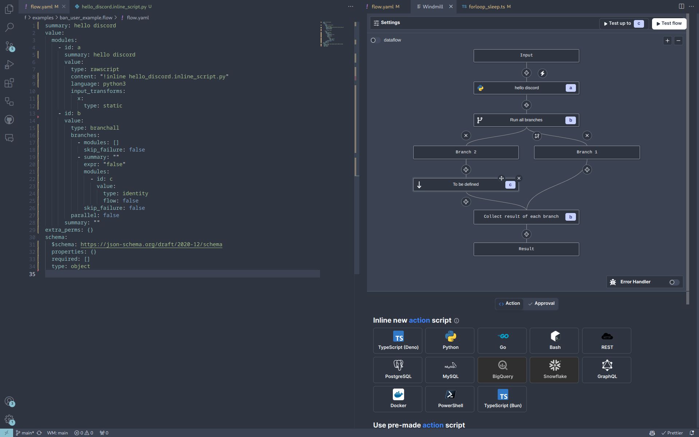
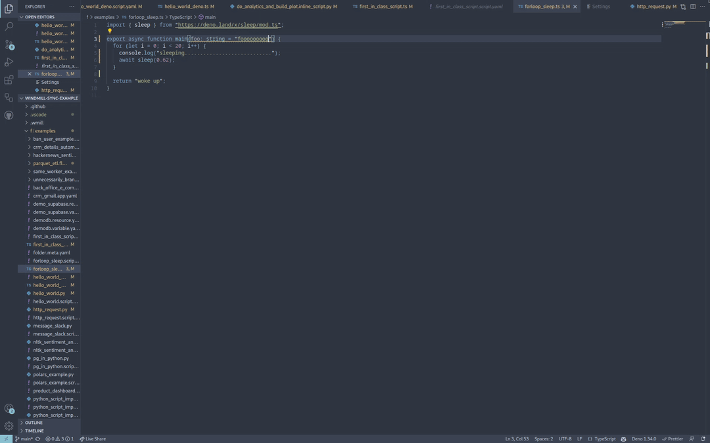

# windmill

Companion of the OSS developer platform windmill.dev for local development and
editing of scripts and flows in VSCode.

[Install it](https://marketplace.visualstudio.com/items?itemName=windmill-labs.windmill)

## Quick Start

Open the command menu (Ctrl/Cmd+Shift+P) and run:

`> Windmill: Configure workspace, remote and token`

In the settings menu, set the remote url, workspace name and token.

Once done, on any page you'd like to edit, run:

`> Windmill: Run preview in the current editor`

The keybidings for that command are: Ctrl+Enter and Shfit+Enter.

