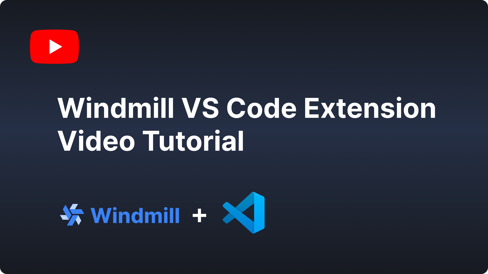

# Windmill

Companion of the [OSS](https://github.com/windmill-labs/windmill) developer platform [windmill.dev](https://www.windmill.dev/) for local development and
editing of scripts and flows in VSCode.

[Install it](https://marketplace.visualstudio.com/items?itemName=windmill-labs.windmill)

[Documentation](https://www.windmill.dev/docs/cli_local_dev/vscode-extension)

## Quick Start

Open the command menu (Ctrl/Cmd+Shift+P) and run:

`> Windmill: Configure remote, workspace and token`

In the settings menu, set the remote url, workspace name and token.

Once done, on any page you'd like to edit, run:

`> Windmill: Run preview`

The keybindings for that command are: Ctrl+Enter and Shift+Enter.

